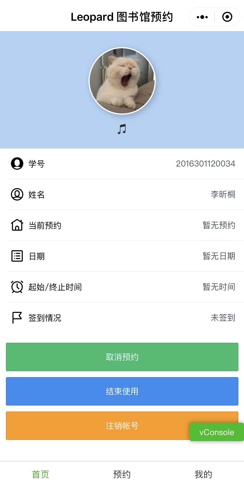

## Leopard 图书馆预约抢座小程序 – 首页模块

### 一、需要实现的功能

1. 从微信小程序的本地缓存中获取用户的账号和密码，发送登录请求，然后从请求中获取用户对应的token，存入到本地缓存中。
2. 根据获取到的token，向服务器请求用户信息和当前预约的信息，保存在缓存中，包括当前有无预约、预约时间及地点、是否已经签到等。
3. 将获取到的用户相关信息加载到页面中，如果没有相应的信息则给出提示。
4. 取消预约：根据当前用户的预约信息进行判断，若正在使用预约或暂无预约，则提示用户无法取消预约；若有尚未签到的预约，则向服务器发送取消预约的请求，成功取消后提示用户。
5. 结束使用：如果用户没有预约或者尚未签到，则无法结束使用，若用户有已签到的预约，则向服务器发送发送结束使用的请求，成功结束则给出提示。
6. 注销账号：用户选择注销账号则回到登录界面。


### 二、使用的抓包Request介绍

#### 1. 用户登录

- 首先从缓存中拿到用户的学号和密码信息，向服务器发送登录请求，获取个人标识符token，Request信息如下，username对应用户的学号，password对应用户的密码：

  > URL: https://seat.lib.whu.edu.cn:8443/rest/auth?username={username}&password={password}
  >
  > Method: GET

- 服务器返回JSON数据如下：

  - 登录成功：

    ```json
    {"status":"success","data":{"token":"SYGD4XO6QX11120840"},"code":"0","message":""}
    ```

  - 登录失败：

    ```json
    {"status":"fail","code":"13","message":"登录失败: 用户名或密码不正确","data":null}
    ```


#### 2. 用户信息

- 拿到了用户的token之后，需要根据token获取当前用户的有关信息，Request信息如下：

  > URL: https://seat.lib.whu.edu.cn:8443/rest/v2/user?token={token}
  >
  > Method: GET

- 服务器返回数据如下：

  - 如果token合法，则返回JSON数据如下：

    ```json
    {
    	"status": "success",
    	"data": {
    		"id": 138911,        // 用户的id，这个应该是一个比较特殊的暂时没看出来用处
    		"enabled": true,                 
    		"name": "{用户姓名}",                   // 用户名
    		"username": "{用户学号}",       // 学号
    		"username2": null,
    		"status": "NORMAL",               // 检测用户状态的变量，如果存在非法的多次请求，短时间内将被封禁使用权限，同时发现自习助手的一侧的数据仍然可以正常使用，考虑中期更换请求链接          
    		"lastLogin": "2019-11-12T14:29:42.000",                 
    		"checkedIn": false,
    		"reservationStatus": null,
    		"lastIn": null,
    		"lastOut": null,
    		"lastInBuildingId": null,
    		"lastInBuildingName": null,
    		"violationCount": 7                           // 违约次数，早退违约、迟到违约等。
    	},
    	"message": "",
    	"code": "0"
    }
    ```

  - 如果不合法，则服务器返回如下：

    ```html
    WHU Library seat reserving system is over loading, please don't use un-offical applications!
    ```

    或者：

    ```html
    ERROR: Abnormal using detected!!!
    ```


#### 3. 预约信息

- 根据token获取用户当前的预约情况，Request信息如下：

  > URL: https://seat.lib.whu.edu.cn:8443/rest/v2/user/reservations?token={token}
  >
  > Method: GET

- 服务器返回数据如下：

  - 如果token合法，则返回JSON数据如下：

    ```json
    {
        "status": "success",
        "data": [{
            "id": 8046397,              // 忽略
            "receipt": "0006-397-2", 
            "onDate": "2019-11-12",      // 日期
            "seatId": 2511,       
            "status": "RESERVE",           // RESERVE预约成功保留中，INUSE使用中等等
            "location": "信息馆1层西区3C创客空间，座位号012",       // 地点
            "begin": "20:00",                   // 开始时间
            "end": "22:30",                 // 结束时间
            "actualBegin": null,
            "awayBegin": null,
            "awayEnd": null,
            "userEnded": false,
            "message": "请在 11月12日19点45分 至 20点35分 之间前往场馆签到"     // 签到信息
        }],
        "message": "",
        "code": "0"
    }
    ```

  - 如果token不合法或者token为空，则服务器返回：

    ```html
    WHU Library seat reserving system is over loading, please don't use un-offical applications!
    ```

  

#### 4. 取消预约

- 用户取消当前的预约请求，Request信息如下，其中seatId代表用户当前预约座位的Id编号：

  > URL: https://seat.lib.whu.edu.cn:8443/rest/v2/cancel/{seatId}?token={token}
  >
  > Method: GET

- 若成功取消，服务器返回数据如下：

  - 若成功取消

    ```json
    {
        "status": "success",
        "data": null,
        "message": "",
        "code": "0"
    }
    ```

  - 若token不合法，则返回：

    ```html
    WHU Library seat reserving system is over loading, please don't use un-offical applications!
    ```


#### 5. 结束使用

- 用户结束当前的预约，Request信息如下：

  > URL: http://seat.lib.whu.edu.cn/rest/v2/stop?token={token}
  >
  > Method: GET

- 服务器返回信息如下：

  - 若成功结束使用

    ```json
    {
        "status": "success",
        "data": null,
        "message": "已终止使用当前预约",
        "code": "0"
    }
    ```

  - 若token不合法，则返回：

    ```html
    WHU Library seat reserving system is over loading, please don't use un-offical applications!
    ```


### 三、使用的页面变量介绍

- account - 用户的学号
- name - 用户名
- locations - 预约场所和地点
- onDate - 预约日期
- period - 预约时间段
- seatId - 预约座位Id
- checkedIn - 是否已签到
- freshTime - 上一次刷新信息的时间
- logout_visible - 注销框是否可见
- cancel_visible - 取消预约框是否可见
- token_alert_visible - token警告框是否可见


### 四、特别需要提及的实现操作

1. 在用户进行取消预约和结束使用操作时，需要特别判断用户是否满足当前操作的状态，如：用户取消预约时，必需有一个尚未签到的预约请求，如果没有预约请求或者预约已签到，则不满足要求，拒绝该操作。用户结束使用时，必需有一个正在使用的预约，如果没有预约或者预约尚未签到，则拒绝请求。
2. 用户进行其他操作会改变当前的状态，因此需要向服务器发送请求，刷新当前页面的信息。而短时间内的多次请求会导致帐号的封停，因此需要对刷新信息的频率加以限制。


### 五、现在实现的功能和存在的问题

1. 现在实现的功能：
   - 抓取用户信息，包括学号、姓名、预约时间地点等。
   - 注销当前帐号，回到登录界面。
   - 结束当前使用的预约。
   - 取消尚未签到的预约。
2. 存在的问题
   - 操作过于频繁会导致封号。


### 六、界面截图

界面截图如下：



